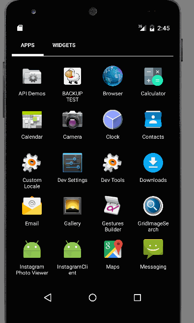

Android Bootcamp Week2 Project - Grid Image Search

Searching for Images using Google API Search

 * [x] User can enter a search query that will display a grid of image results from the Google Image API.
 * [x] User can tap on any image in results to see the image full-screen
 * [x] image results appears in one screen (total 8)

GIF created with [LiceCap](http://www.cockos.com/licecap/).

Total Time spent: 5 hours

